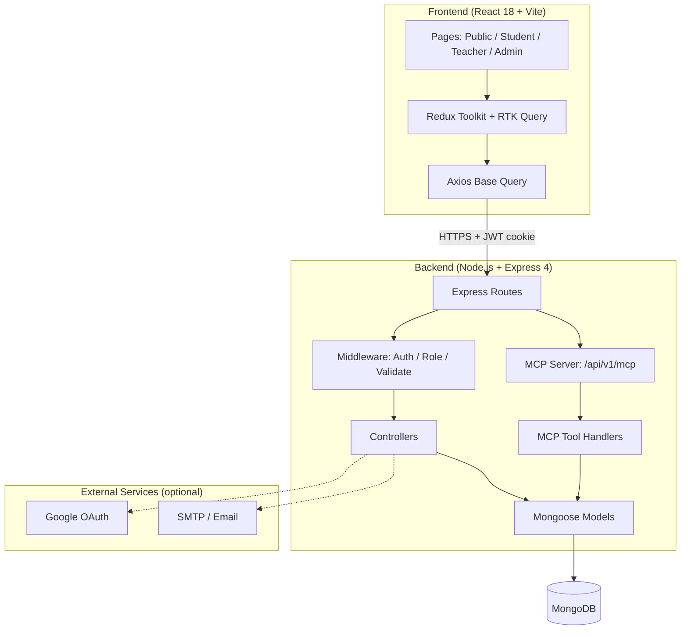

# Skillify

Skillify is a full-stack Learning Management System (LMS) inspired by Khan Academy — students enroll in and learn from courses, teachers create and manage course content, and admins moderate the platform.

[](client)
[](server)
[](server/models)

---

## Features

- **Public**: Browse and filter courses by category, level, and search; view course detail and enroll
- **Auth**: Email/password and Google OAuth sign-in, JWT access + refresh tokens (httpOnly cookies), password reset via email
- **Students**: Dashboard, lesson player with completion tracking, quiz taking with instant results, progress overview
- **Teachers**: Create/edit courses, manage lessons and quizzes, submit for admin approval, view per-course student progress
- **Admins**: Dashboard with charts, user management (activate/deactivate/delete), course moderation (approve/reject), platform analytics
- **MCP server**: A Model Context Protocol endpoint (`/api/v1/mcp`) that exposes courses, users, enrollments, and analytics as tools/resources/prompts for AI clients

---

## Architecture Overview



### Typical flow
1. A visitor browses the public course catalog.
2. After registering/logging in (email+password or Google), a student enrolls in a course, completes lessons, and takes quizzes.
3. A teacher creates a course with lessons and quizzes, then submits it for admin approval.
4. An admin reviews pending courses, approves/rejects them, manages users, and reviews platform-wide analytics.
5. An MCP-compatible AI client can query courses, progress, and analytics through the `/api/v1/mcp` JSON-RPC endpoint.

---

## Tech Stack

| Layer | Technology |
|---|---|
| Frontend | React 18, Vite, Redux Toolkit (RTK Query), React Router v6, Bootstrap 5, Chart.js |
| Backend | Node.js, Express 4, Mongoose 8, JWT (access + refresh tokens via httpOnly cookies) |
| Database | MongoDB (local or MongoDB Atlas) |
| Auth | JWT + bcrypt password hashing, optional Google OAuth |

---

## Project Structure

```
Skillfy/
├── client/                     # React frontend (Vite)
│   └── src/
│       ├── app/                # Redux store
│       ├── components/         # Shared UI components (common, course, lesson, quiz, layout)
│       ├── features/           # Redux slices (auth, ui)
│       ├── hooks/               # Custom React hooks
│       ├── pages/               # Route-level page components (public, auth, student, teacher, admin, user, misc)
│       ├── services/            # RTK Query API slices
│       └── utils/                # Helpers (axios, formatters)
└── server/                     # Express backend
    ├── config/                 # DB connection
    ├── constants/               # Role definitions
    ├── controllers/             # Route handlers
    ├── mcp/                     # Model Context Protocol server (tools, handlers, dispatcher)
    ├── middleware/               # Auth, roles, validation, errors
    ├── models/                   # Mongoose schemas
    ├── routes/                   # Express routers
    ├── seed/                     # Database seeder (creates schema + sample data — no separate migrations needed)
    ├── utils/                     # Async handler, API response, tokens, email
    ├── validators/                # express-validator schemas
    └── test-api.js                # API smoke-test script
```

---

## Prerequisites

- [Node.js 18+](https://nodejs.org/) and npm
- MongoDB — either a local instance (`mongodb://localhost:27017`) or a free [MongoDB Atlas](https://www.mongodb.com/atlas) cluster
  - If your network blocks SRV DNS lookups, use the **standard** (non-`+srv`) Atlas connection string instead of `mongodb+srv://`

---

## Getting Started

### 1. Clone the repository

```bash
git clone https://github.com/ronakb769/Skillfy.git
cd Skillfy
```

### 2. Install dependencies

```bash
# Backend
cd server
npm install

# Frontend
cd ../client
npm install
```

### 3. Configure environment variables

Copy the template and fill in your own values — **never commit the real `.env` file**:

```bash
cd server
cp .env.example .env
```

| Variable | Required | Description |
|---|---|---|
| `NODE_ENV` | Yes | `development` or `production` |
| `PORT` | Yes | API port (default `5000`) |
| `CLIENT_URL` | Yes | Frontend origin for CORS (default `http://localhost:5173`) |
| `MONGO_URI` | Yes | MongoDB connection string |
| `JWT_SECRET` / `JWT_REFRESH_SECRET` | Yes | Random, unique secrets (32+ characters) — generate with `node -e "console.log(require('crypto').randomBytes(48).toString('hex'))"` |
| `JWT_EXPIRE` / `JWT_REFRESH_EXPIRE` | Yes | Token lifetimes (e.g. `15m`, `7d`) |
| `GOOGLE_CLIENT_ID` / `GOOGLE_CLIENT_SECRET` | Optional | Enables "Sign in with Google" |
| `SMTP_HOST` / `SMTP_PORT` / `SMTP_USER` / `SMTP_PASS` / `FROM_NAME` / `FROM_EMAIL` | Optional | Enables password-reset and notification emails |
| `MCP_SECRET` | Optional | Shared secret for server-to-server MCP clients (alternative to a user JWT) |

The frontend does not require an `.env` file for local development — it talks to the API via the Vite dev proxy configured in `client/vite.config.js`.

### 4. Database schema & seed data

Skillify uses MongoDB/Mongoose, which is schemaless at the database level — collections and indexes are created automatically from the models in `server/models/` on first write, so there are **no separate migration scripts to run**.

To create sample data (users, courses, lessons, quizzes, enrollments):

```bash
cd server
npm run seed
```

This creates the following accounts (passwords are for local development only — change them before any non-local use):

| Role | Email | Password |
|---|---|---|
| Admin | admin@skillify.com | `Admin@1234` |
| Teacher | teacher1@skillify.com | `Teacher@1234` |
| Teacher | teacher2@skillify.com | `Teacher@1234` |
| Teacher | teacher3@skillify.com | `Teacher@1234` |
| Student | student1@skillify.com | `Student@1234` |

### 5. Run in development

Open two terminals:

```bash
# Terminal 1 — Backend (http://localhost:5000)
cd server
npm run dev

# Terminal 2 — Frontend (http://localhost:5173)
cd client
npm run dev
```

Visit `http://localhost:5173`. The API is available at `http://localhost:5000/api/v1`.

### 6. Production build

```bash
cd client
npm run build      # outputs client/dist — serve behind any static host / reverse proxy

cd ../server
npm start           # runs the API with NODE_ENV=production in your .env
```

---

## Testing

There is no automated unit/integration test suite yet. A smoke-test script exercises the running API end-to-end (health check, login, course listing, progress, admin stats, and the MCP endpoints):

```bash
# 1. Seed the database and start the backend (see steps above)
cd server
npm run dev

# 2. In another terminal, run the smoke tests against the running server
npm test
```

It prints a pass/fail table and exits non-zero if any check fails.

---

## API Endpoints

| Resource | Endpoints |
|---|---|
| Auth | `POST /auth/register`, `POST /auth/login`, `POST /auth/logout`, `POST /auth/refresh`, `GET /auth/google`, `GET /auth/google/callback`, `POST /auth/forgot-password`, `POST /auth/reset-password`, `GET /auth/me`, `PUT /auth/profile`, `PATCH /auth/password` |
| Courses | `GET /courses`, `GET /courses/:id`, `POST /courses`, `PUT /courses/:id`, `DELETE /courses/:id`, `PATCH /courses/:id/submit`, `PATCH /courses/:id/approve`, `PATCH /courses/:id/reject`, `GET /courses/teacher/mine` |
| Lessons | `GET /lessons/course/:courseId`, `GET /lessons/:id`, `POST /lessons`, `PUT /lessons/:id`, `DELETE /lessons/:id`, `POST /lessons/:id/complete` |
| Quizzes | `GET /quizzes/course/:courseId`, `GET /quizzes/:id`, `POST /quizzes`, `PUT /quizzes/:id`, `DELETE /quizzes/:id`, `POST /quizzes/:id/attempt` |
| Enrollments | `POST /enrollments`, `GET /enrollments/my`, `DELETE /enrollments/:courseId`, `GET /enrollments/course/:courseId` |
| Progress | `GET /progress/overview`, `GET /progress/course/:courseId`, `GET /progress/course/:courseId/all`, `GET /progress/student/:studentId/course/:courseId` |
| Users | `GET /users`, `GET /users/:id`, `PATCH /users/:id/status`, `DELETE /users/:id` |
| Admin | `GET /admin/stats`, `GET /admin/pending-courses`, `GET /admin/enrollments-chart`, `GET /admin/users-chart`, `GET /admin/top-courses` |
| MCP | `POST /mcp` (JSON-RPC 2.0), `GET /mcp/sse` — see [MCP Server](#mcp-server) below |

---

## Roles & Permissions

| Action | Student | Teacher | Admin |
|---|:---:|:---:|:---:|
| Browse courses | ✓ | ✓ | ✓ |
| Enroll in courses | ✓ | — | — |
| Complete lessons / take quizzes | ✓ | — | — |
| Create / manage courses | — | ✓ | — |
| Approve / reject courses | — | — | ✓ |
| Manage users | — | — | ✓ |
| View platform analytics | — | — | ✓ |

---

## MCP Server

Skillify exposes a [Model Context Protocol](https://modelcontextprotocol.io/) server at `POST /api/v1/mcp`, letting AI clients query platform data as tools/resources/prompts.

- **Transport**: HTTP POST `http://localhost:5000/api/v1/mcp` (JSON-RPC 2.0), plus an SSE endpoint at `/api/v1/mcp/sse`
- **Auth**: `Authorization: Bearer <jwt>` (same tokens as the rest of the API), or `x-mcp-secret: <MCP_SECRET>` for server-to-server clients
- **Tools**: `get_courses`, `get_course_detail`, `get_users` (admin-only), `get_enrollments`, `get_student_progress`, `get_analytics_summary`, `get_quiz_results`, `search_content`
- **Resources**: `skillify://analytics/summary`, `skillify://courses/catalog`
- **Prompts**: `analyze_student`, `course_recommendation`, `quiz_question_generator`, `lesson_outline_generator`

Quick test:

```bash
curl -X POST http://localhost:5000/api/v1/mcp \
  -H "Content-Type: application/json" \
  -d '{"jsonrpc":"2.0","id":1,"method":"tools/list","params":{}}'
```

> **Note**: in non-production environments (`NODE_ENV !== 'production'`), unauthenticated requests are allowed as a read-only "guest" for local development convenience. Set `NODE_ENV=production` and configure `MCP_SECRET` before exposing this endpoint publicly.

---

## Security Notes

- No secrets, `.env` files, or API keys are committed to this repository — copy `server/.env.example` to `server/.env` and fill in your own values.
- Passwords are hashed with bcrypt; JWTs are short-lived access tokens plus httpOnly refresh tokens.
- `helmet`, rate limiting, and `express-validator` input validation are applied on the API.
- Known dependency advisories were reviewed before publishing:
  - Server dependencies are patched to their latest secure versions (`npm audit` reports 0 vulnerabilities).
  - Two client-side advisories remain and are intentionally deferred because fixing them requires a major-version upgrade that needs regression testing before merging: `vite`/`esbuild` (dev-server-only issue, fix requires Vite 5 → 8) and `react-router-dom` (fix requires v6 → v7). Run `npm audit` in `client/` before deploying to production and evaluate upgrading.
- If you fork this project, generate your own `JWT_SECRET`/`JWT_REFRESH_SECRET` and rotate `MCP_SECRET` — never reuse values from any example or documentation.

---

## Claude Code Assets

This repo includes Claude Code configuration for local development (`.claude/`, `CLAUDE.md`) — custom skills (`/check`, `/debug`, `/seed`, `/generate-quiz`, `/generate-lesson`, `/analyze-student`, `/api-test`, `/scaffold`, `/mcp-query`) that assist with day-to-day development on this codebase. These are developer tooling only and are not required to run the application.

---

## License

Proprietary — All rights reserved, unless a `LICENSE` file is added to this repository.
